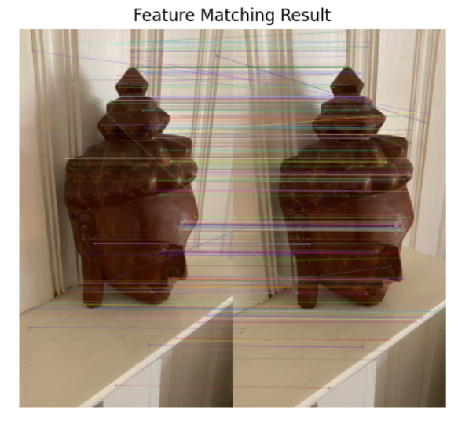
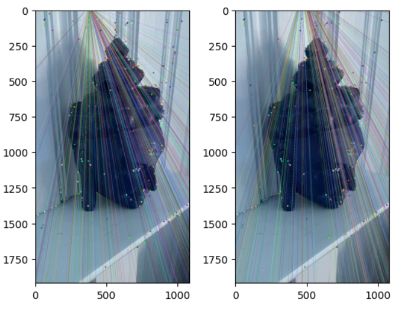
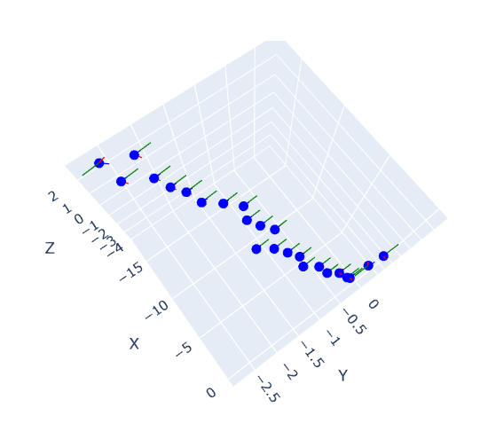
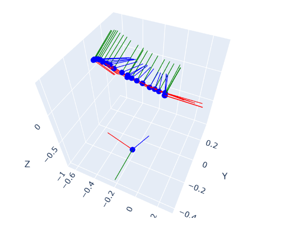

# 3D Structure from Motion (SfM) Algorithm

## Overview
Structure from Motion (SfM) was a computer vision technique that reconstructed a 3D scene from a set of 2D images. The algorithm aimed to recover the 3D structure of a scene and the camera poses from a series of images.

## Steps

1. **Feature Matching and Outlier Rejection using RANSAC:**
   - Identified key features in multiple images (used SIFT detector).
   - Utilized the Random Sample Consensus (RANSAC) algorithm to robustly match these features across images.
   - Eliminated outliers to improve the accuracy of subsequent steps.

     Identified key features using SIFT detector:
      
     

2. **Estimating Fundamental Matrix:**
   - Calculated the Fundamental Matrix, a fundamental geometric relationship between image pairs.
   - Described the epipolar geometry between two views.

     Visualizing Epipolar lines using Fundamental matrix:
      
     

3. **Estimating Essential Matrix from Fundamental Matrix:**
   - Derived the Essential Matrix from the Fundamental Matrix by incorporating camera intrinsic parameters.
   - The Essential Matrix encapsulated information about the relative pose of the cameras.

4. **Estimate Camera Pose from Essential Matrix:**
   - Extracted camera poses (rotation and translation) from the Essential Matrix.
   - Recovered the motion of the camera in relation to the scene.
  

     Plotting camera poses before Bundle Adjustment (GTSAM):
      
     

5. **Check for Cheirality Condition using Triangulation:**
   - Ensured that the reconstructed points lie in front of both cameras by applying the chirality condition.
   - Discarded points violating this condition as they may be behind one of the cameras.

6. **Perspective-n-Point:**
   - Utilized the Perspective-n-Point (PnP) algorithm to estimate the 3D position of the matched points in the world coordinates.
   - This step refined the initial camera poses obtained from the Essential Matrix.

     Sparse 3D reconstruction before Bundle Adjustment (GTSAM):
      
     

7. **Bundle Adjustment (using GTSAM):**
   - Optimized the entire reconstruction by jointly refining camera poses and 3D points.
   - Leveraged the Generalized Trajectory Optimization (GTSAM) library for efficient bundle adjustment.
  

     Plotting camera poses after bundle adjustment (GTSAM):
      
     

     Sparse 3D reconstruction after Bundle Adjustment (GTSAM):
      
     

## Implementation
   - The implementation of these steps in the project involved using libraries like OpenCV for fundamental and essential matrix calculations, GTSAM for bundle adjustment, and other relevant computer vision libraries.

## Usage
   - Clear instructions were provided on how to use the SfM algorithm in the project, specifying input requirements and expected output.

By following these steps, the SfM algorithm effectively reconstructed 3D scenes from a series of 2D images, providing valuable insights into the structure and motion of the observed environment.
